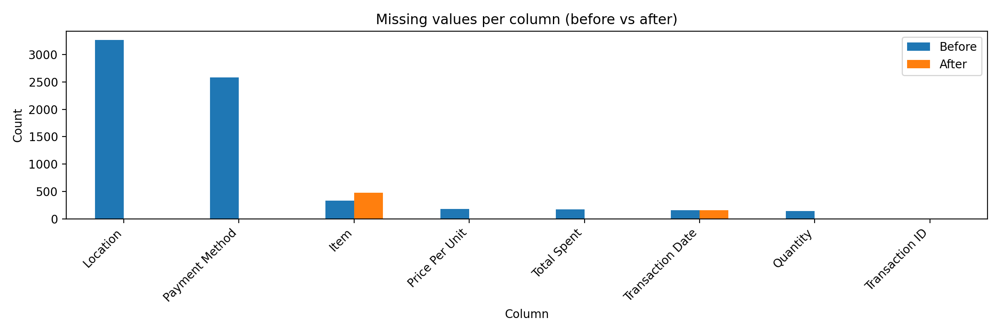
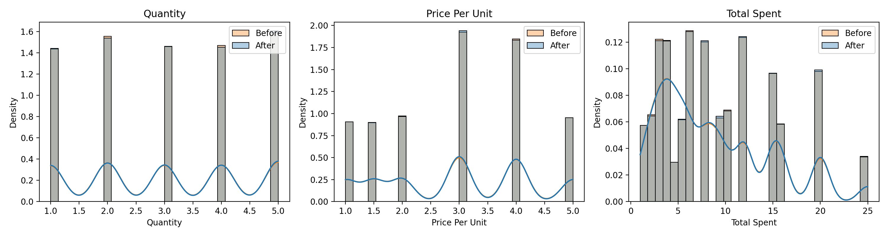
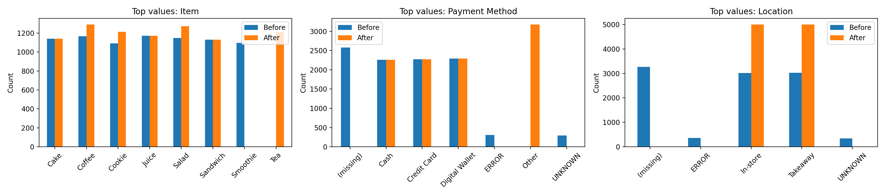

# Cafe Sales Data Cleaning — Before vs After

This folder contains the **raw cafe sales dataset** used in the cleaning notebook.

## Dataset
- Source (raw): `dirty_cafe_sales.csv`
- Notebook: `../cafe_clean.ipynb`
- Report (full): `../reports/cafe_cleaning_report.md`

## Summary (Before vs After)

| Metric | Before cleaning | After cleaning |
|---|---:|---:|
| Rows | 10,000 | 10,000 |
| Columns | 8 | 9 |
| Total missing cells | 6,826 | 639 |
| Duplicate rows | 0 | 0 |

### Missing values by column

**Before (raw):**
- Location: 3,265
- Payment Method: 2,579
- Item: 333
- Price Per Unit: 179
- Total Spent: 173
- Transaction Date: 159
- Quantity: 138
- Transaction ID: 0

**After (cleaned):**
- Item: 480
- Transaction Date: 159
- All other columns: 0

Notes:
- Numeric fields are fully cleaned and imputed: `Quantity`, `Price Per Unit`, `Total Spent` now have 0 missing.
- `Location` and `Payment Method` are fully filled (0 missing).
- Remaining missingness is limited to `Item` and `Transaction Date`.

## Visualizations (Before vs After)

### 1) Missingness comparison

### 2) Numeric distributions (Quantity / Price Per Unit / Total Spent)

### 3) Top categories (Item / Payment Method / Location)

